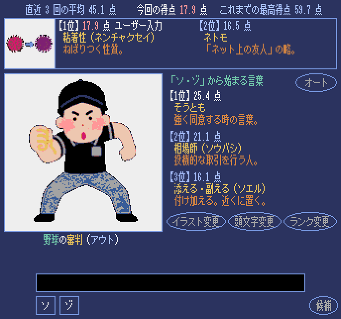
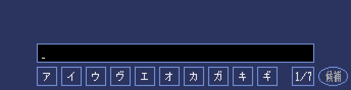

# ぴったりワード

[いらすとや](https://www.irasutoya.com/)のイラストに合った言葉を入力すると、関連性が数値で表示されます。

## 操作方法

* キーボードでローマ字入力するか、マウスで選択入力します。

## 遊び方

* イラストと言葉の関連性が数値で表示されます。
* ランダムに選ばれたイラストに対して、関連性が高いと思われる言葉を入力して、より高い数値を目指します。
* 言葉（単語）を入力すると、その意味が表示されます。
* 意味が表示されている状態で【ENTER】キー又は【確定】ボタンを押すと、決定です。

## 実行

* [JustWord.exe](https://github.com/aged99oow/just/raw/refs/heads/main/JustWord.exe?download=) ダウンロードして実行します。
* 動作環境は、Windowsです。

___
___

# ぴったん辞書

[もじぴったん](https://encore.mojipittan.jp/)の言葉を基にした辞書です。  

## 操作方法

* キーボードでローマ字入力するか、マウスで選択入力します。

## 遊び方

* 言葉（単語）を入力すると、その意味が表示されます。

## 実行

* https://aged99oow.github.io/just/
